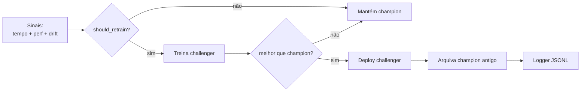
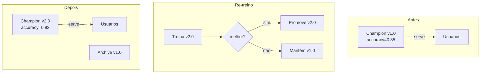

# 🏗️ Arquitetura — Aula 07: Re-Treino Automático

A **Aula 07** une **decisão automática** + **comparação champion/challenger** + **agendamento** para fechar o ciclo de vida do modelo.

---

## 🎯 Visão Geral



> 📌 Diagramas Mermaid podem não renderizar em previews simples. Abaixo, a versão ASCII do gatilho por drift no Airflow (portável).

**Gatilho por drift na DAG (Airflow):**

```
   schedule (cron)
        │
        ▼
  ┌────────────┐   lê drift_report.json (Aula 06)
  │ check_drift│──────────────────────────────────┐
  └─────┬──────┘                                   │
   sim  │  não                                     │
   ┌────┴─────┐                                    │
   ▼          ▼                                    │
retrain_   skip_retrain                            │
pipeline   (EmptyOperator)                         │
   └────┬──────┘                                   │
        ▼                                          │
      done  ◀──────────────────────────────────────┘
   (none_failed_min_one_success)
```

| Etapa | Responsabilidade | Arquivo |
|-------|------------------|---------|
| **Policy** | Decidir se retreina | `src/retrain/policy.py` |
| **Drift Gate** | Ler drift (Aula 06) → sinais | `src/retrain/drift_gate.py` |
| **Training** | Treinar challenger (fixo ou AutoML) | `src/retrain/training.py` |
| **Comparison** | Champion vs challenger | `src/retrain/comparison.py` |
| **Deploy** | Promover ou rollback | `src/retrain/deploy.py` |
| **Pipeline** | Orquestrador | `src/retrain/pipeline.py` |
| **Job** | Função que a task do Airflow executa | `src/retrain/job.py` |
| **Monitoring** | Histórico JSONL | `src/retrain/monitoring.py` |
| **DAG Airflow** | Agendamento + branch por drift | `dags/retrain_dag.py` |

---

## 📁 Estrutura de Diretórios

```
fiap-ml-aula07/
├── .gitignore
├── README.md
├── requirements.txt
├── pytest.ini
├── docs/
│   ├── ARCHITECTURE.md
│   ├── CHEATSHEET.md
│   ├── HANDS-ON-07-01.md     # Drift + Estratégias
│   ├── HANDS-ON-07-02.md     # Pipeline + AutoML + Comparação
│   └── HANDS-ON-07-03.md     # Gatilho por drift (Airflow)
├── src/
│   └── retrain/
│       ├── policy.py
│       ├── training.py
│       ├── comparison.py
│       ├── deploy.py
│       ├── pipeline.py
│       ├── job.py
│       ├── drift_gate.py
│       └── monitoring.py
├── scripts/
│   ├── scenario_healthy.py
│   ├── scenario_perf_drop.py
│   ├── scenario_drift.py
│   ├── run_pipeline.py
│   ├── run_automl.py
│   ├── demo_rollback.py
│   └── run_job.py
├── dags/
│   └── retrain_dag.py
├── tests/
│   ├── test_policy.py
│   ├── test_comparison.py
│   ├── test_pipeline.py
│   ├── test_training_automl.py
│   └── test_drift_gate.py
└── models/                    # Production + archive (gitignored)
```

---

## 🆚 Champion / Challenger = Blue / Green



---

## 🧱 Decisões de Design

### 1. Política via `dataclass`
`RetrainSignals` agrupa todos sinais. Fácil de testar, fácil de evoluir.

### 2. "Qualquer um dispara" (OR)
Combinador é `any()` — qualquer sinal positivo retreina. Conservador.

### 3. Threshold de melhoria (2% default)
Evita "flip-flop" de deploy por variação estatística. Configurável.

### 4. Archive antes de promover
Antes de sobrescrever `production.pkl`, copia para `archive/`. Rollback fácil.

### 5. JSONL para histórico
Append-only, fácil de processar com `jq`/pandas. Padrão de observabilidade.

### 6. `max_active_runs=1` no Airflow
Garante exclusividade (só 1 re-treino por vez) sem precisar de lock manual.

### 7. Gatilho por drift (não só cron)
A DAG roda no schedule, mas quem **decide** treinar é o `drift_gate` lendo o relatório da Aula 06. O `BranchPythonOperator` desliga o re-treino quando não há sinal — economiza compute e evita re-treino desnecessário.

### 8. AutoML como busca de hiperparâmetros
`train_challenger_automl` usa `RandomizedSearchCV` (orçamento controlado por `n_iter`). Porta de entrada para FLAML/auto-sklearn/Optuna sem dependência extra.

---

## 🆚 Analogias DevOps

| Re-treino ML | DevOps |
|--------------|--------|
| Champion → Challenger | Blue → Green |
| Deploy do challenger | Deploy de nova versão |
| Archive de champion | Tag da versão anterior |
| Rollback | `kubectl rollout undo` |
| `should_retrain()` | Health check + autoscaler |
| `max_active_runs=1` | Singleton deployment |

---

## 🚀 Próximo Passo

A Aula 08 vai amarrar tudo num **CI/CD completo**: PR → testes → build → deploy automático, com este pipeline de re-treino rodando em Airflow.
