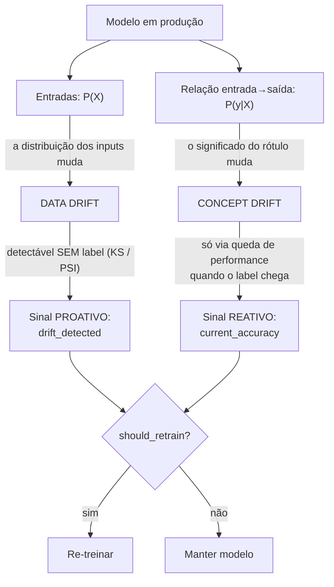
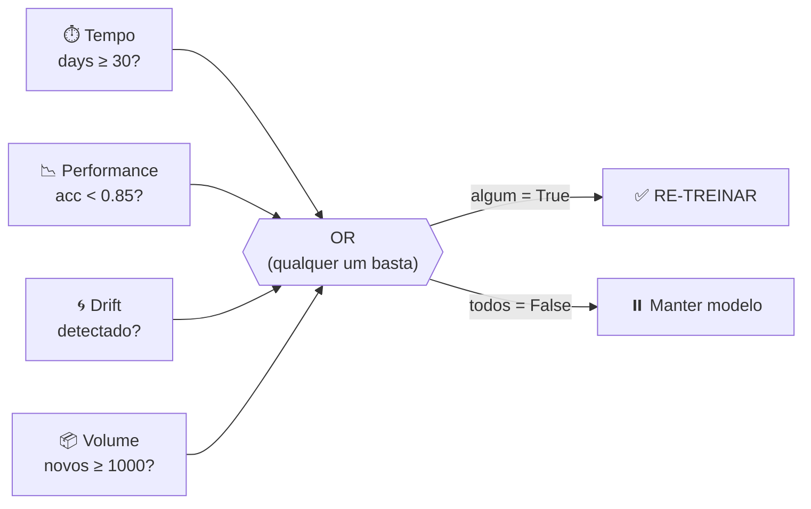

# 🎬 Vídeo 7.1 - Drift e Estratégias de Re-Treino

**Aula**: 7 - Treinamento Automático e Re-Treino  
**Vídeo**: 7.1  
**Temas**: Data drift vs concept drift; Revalidação contínua; 4 estratégias de re-treino

---

## 🚀 Sobre Este Vídeo

> **"Modelo em produção decai. Re-treino é o `kubectl rollout restart` do ML."**

### O que você vai fazer:

| Etapa | Descrição |
|-------|-----------|
| **Estratégias** | 4 abordagens de re-treino |
| **Função de decisão** | `should_retrain()` configurável |
| **Combinar sinais** | Tempo + performance + drift |
| **Cenários** | Simular 3 situações reais |

### Pré-requisitos

| Requisito | Como verificar |
|-----------|----------------|
| Aula 06 concluída | `monitoring/drift.py` funcionando |
| Python 3.9+ | `python3 --version` |
| scikit-learn instalado | `python -c "import sklearn"` |

---

## 📚 Parte 1: Por Que Re-Treinar?

### Passo 1: Modelos Decaem no Tempo

```
Janeiro:  accuracy = 0.95  ✅
Março:    accuracy = 0.90  🟡
Junho:    accuracy = 0.75  ❌ degradou!
```

**Causas:**

| Causa | Exemplo |
|-------|---------|
| **Data drift** | Comportamento de cliente mudou |
| **Concept drift** | Definição do que é fraude mudou |
| **Sazonalidade** | Black Friday muda padrão |
| **Mudança de produto** | Nova feature no app |

> 💡 **Ponto-chave**: Re-treino **não é falha** — é manutenção esperada, igual rollout de patch de segurança.

---

## 🧠 Parte 1.5: Conceituação — Data Drift vs Concept Drift

Antes de decidir *quando* retreinar, é preciso nomear **o que** muda. Há dois fenômenos distintos, e eles exigem respostas diferentes.

### Definições

| Conceito | O que muda | Notação | Exemplo |
|----------|------------|---------|---------|
| **Data Drift** (covariate shift) | A distribuição das **entradas** `P(X)` | `P(X)` muda, `P(y\|X)` igual | A faixa etária dos clientes mudou; o modelo ainda acerta, mas vê dados que não viu no treino |
| **Concept Drift** | A relação **entrada→saída** `P(y\|X)` | `P(y\|X)` muda | O que era "fraude" mudou de padrão; o mesmo input agora tem outro rótulo |
| **Label Drift** (prior shift) | A distribuição das **saídas** `P(y)` | `P(y)` muda | A proporção de fraudes subiu de 1% para 8% |

> 🔍 **Nos bastidores**: a diferença prática está em **o que você consegue medir sem rótulo**.
> - **Data drift** é detectável só com os inputs de produção (KS test, PSI, distância de distribuições). **Não precisa esperar o ground-truth.**
> - **Concept drift** só aparece de forma direta quando o rótulo real chega — por isso costuma ser inferido pela **queda de performance** depois que os labels chegam (com atraso).

### Por que isso importa para a decisão de re-treino



> 🗣️ **Como explicar (roteiro de 30s)**: "Um modelo tem dois lados que podem mudar.
> O lado da **entrada** — os dados que chegam — quando muda, é **data drift**, e eu
> consigo perceber só olhando os inputs, sem nem saber se acertei. O lado da
> **relação entrada→saída** — o que aquele dado significa — quando muda, é **concept
> drift**, e esse eu só vejo quando o resultado real chega e a accuracy cai. Por isso
> drift é um alarme **proativo** (toca antes) e performance é **reativo** (confirma o
> estrago). Os dois viram sinais que alimentam a mesma decisão: `should_retrain?`."

### Revalidação Contínua

Revalidação contínua é o hábito de **reavaliar o modelo em ciclo**, não só quando algo quebra:

| Camada | O que faz | Frequência |
|--------|-----------|------------|
| **Monitoramento de inputs** | KS/PSI sobre `P(X)` → detecta data drift | Contínua (cada batch) |
| **Monitoramento de performance** | accuracy/F1 quando o label chega → detecta concept drift | Quando há ground-truth |
| **Revalidação agendada** | re-roda a suíte de validação do modelo | Periódica (ex.: diária) |
| **Gatilho de re-treino** | `should_retrain()` combina os sinais acima | A cada checagem |

> 💡 **Ponto-chave**: monitoramento ativo é o que transforma "o modelo decaiu e ninguém viu" em "o sistema percebeu o drift e disparou o re-treino sozinho". É a ponte entre a **Aula 06 (detecção)** e esta aula (**ação**).

> 📌 A detecção de drift em si (implementação do KS test sobre os inputs) foi construída na **Aula 06**. Aqui partimos do **resultado** dela — um booleano/score de drift — e o usamos como um dos sinais de decisão. No Vídeo 7.3 esse resultado vira o **gatilho** que dispara a DAG.

---

## 🛠️ Parte 2: Setup

### Passo 2: Estrutura

**Linux/Mac:**
```bash
mkdir -p ~/fiap-mlops/aula07
cd ~/fiap-mlops/aula07
python3 -m venv venv
source venv/bin/activate
pip install scikit-learn pandas mlflow pytest scipy
```

**Windows (PowerShell):**
```powershell
New-Item -ItemType Directory -Path "$HOME\fiap-mlops\aula07" -Force
cd "$HOME\fiap-mlops\aula07"
python -m venv venv
.\venv\Scripts\Activate.ps1
pip install scikit-learn pandas mlflow pytest scipy
```

✅ Ambiente pronto.

---

## 🎯 Parte 3: As 4 Estratégias

### Passo 3: Tabela Comparativa

| Estratégia | Trigger | Vantagem | Desvantagem |
|------------|---------|----------|-------------|
| **Time-based** | A cada N dias | Simples | Pode treinar quando não precisa |
| **Performance-based** | Accuracy < threshold | Só treina quando preciso | Precisa de label em produção |
| **Drift-based** | KS test detecta drift | Não precisa de label | Drift ≠ degradação |
| **Volume-based** | A cada N novos exemplos | Aproveita dado novo | Pode treinar com pouco sinal |

**Como as 4 estratégias viram UMA decisão:**



> 🗣️ **Como explicar (30s)**: "Cada estratégia é um sensor independente: tempo,
> performance, drift e volume. Eu não escolho uma — eu **combino as quatro** numa
> função `should_retrain()`. A regra é um **OR**: se **qualquer** sensor acender, eu
> retreino. É a postura conservadora — na dúvida, retreina. Em produção real você
> pode trocar esse OR por uma regra com pesos, mas para começar, 'qualquer um basta'
> já protege o modelo."

---

### Passo 4: Implementar Decisão

**Criar `src/retrain/policy.py`:**

```python
"""Políticas de decisão para re-treino."""
import logging
from dataclasses import dataclass

logger = logging.getLogger(__name__)


@dataclass
class RetrainSignals:
    """Sinais que entram na decisão de re-treinar."""
    days_since_last_train: int
    current_accuracy: float
    drift_detected: bool
    new_samples: int


def should_retrain_time(days: int, max_days: int = 30) -> bool:
    """Re-treina a cada N dias."""
    decision = days >= max_days
    logger.info(f"[TIME]  {days}d / {max_days}d max → {decision}")
    return decision


def should_retrain_performance(accuracy: float, threshold: float = 0.85) -> bool:
    """Re-treina se accuracy caiu abaixo do threshold."""
    decision = accuracy < threshold
    logger.info(f"[PERF]  {accuracy:.3f} < {threshold} → {decision}")
    return decision


def should_retrain_drift(drift_detected: bool) -> bool:
    """Re-treina se drift foi detectado."""
    logger.info(f"[DRIFT] detectado={drift_detected} → {drift_detected}")
    return drift_detected


def should_retrain_volume(new_samples: int, threshold: int = 1000) -> bool:
    """Re-treina se acumulou N novos exemplos."""
    decision = new_samples >= threshold
    logger.info(f"[VOL]   {new_samples} / {threshold} → {decision}")
    return decision


def should_retrain(signals: RetrainSignals) -> bool:
    """Combina TODAS estratégias. Re-treina se QUALQUER uma dispara."""
    decisions = [
        should_retrain_time(signals.days_since_last_train),
        should_retrain_performance(signals.current_accuracy),
        should_retrain_drift(signals.drift_detected),
        should_retrain_volume(signals.new_samples),
    ]
    final = any(decisions)
    logger.info(f"➡️  DECISÃO FINAL: {'RE-TREINAR' if final else 'manter modelo'}")
    return final
```

---

### Passo 5: Cenário 1 — Modelo Saudável

**Criar `scripts/scenario_healthy.py`:**

```python
"""Cenário 1: Modelo saudável, sem necessidade de re-treino."""
import logging
from retrain.policy import RetrainSignals, should_retrain

logging.basicConfig(level=logging.INFO, format="%(message)s")

print("=== Cenário 1: Modelo Saudável ===\n")
signals = RetrainSignals(
    days_since_last_train=10,
    current_accuracy=0.92,
    drift_detected=False,
    new_samples=200,
)
should_retrain(signals)
```

**Executar:**

**Linux/Mac:**
```bash
mkdir -p src/retrain scripts
touch src/__init__.py src/retrain/__init__.py
# (criar arquivos)
PYTHONPATH=src python scripts/scenario_healthy.py
```

**Windows (PowerShell):**
```powershell
New-Item -ItemType Directory -Path src\retrain, scripts -Force
New-Item -ItemType File -Path src\__init__.py, src\retrain\__init__.py -Force
$env:PYTHONPATH = "src"
python scripts\scenario_healthy.py
```

**Resultado esperado:**
```
=== Cenário 1: Modelo Saudável ===

[TIME]  10d / 30d max → False
[PERF]  0.920 < 0.85 → False
[DRIFT] detectado=False → False
[VOL]   200 / 1000 → False
➡️  DECISÃO FINAL: manter modelo
```

✅ Modelo saudável: não retreina.

---

### Passo 6: Cenário 2 — Performance Caiu

**Criar `scripts/scenario_perf_drop.py`:**

```python
"""Cenário 2: Performance caiu."""
import logging
from retrain.policy import RetrainSignals, should_retrain

logging.basicConfig(level=logging.INFO, format="%(message)s")

print("=== Cenário 2: Performance Caiu ===\n")
signals = RetrainSignals(
    days_since_last_train=10,
    current_accuracy=0.78,    # CAIU
    drift_detected=False,
    new_samples=200,
)
should_retrain(signals)
```

**Executar:**

**Linux/Mac e Windows:**
```bash
PYTHONPATH=src python scripts/scenario_perf_drop.py
```

**Resultado esperado:**
```
=== Cenário 2: Performance Caiu ===

[TIME]  10d / 30d max → False
[PERF]  0.780 < 0.85 → True       ← TRIGGER!
[DRIFT] detectado=False → False
[VOL]   200 / 1000 → False
➡️  DECISÃO FINAL: RE-TREINAR
```

✅ Detectou queda de performance.

---

### Passo 7: Cenário 3 — Drift sem Label

**Criar `scripts/scenario_drift.py`:**

```python
"""Cenário 3: Drift detectado (sem label em produção)."""
import logging
from retrain.policy import RetrainSignals, should_retrain

logging.basicConfig(level=logging.INFO, format="%(message)s")

print("=== Cenário 3: Drift sem Label ===\n")
signals = RetrainSignals(
    days_since_last_train=10,
    current_accuracy=0.90,    # parece ok mas...
    drift_detected=True,      # DRIFT detectado nos inputs!
    new_samples=200,
)
should_retrain(signals)
```

**Executar:**

**Linux/Mac e Windows:**
```bash
PYTHONPATH=src python scripts/scenario_drift.py
```

**Resultado esperado:**
```
=== Cenário 3: Drift sem Label ===

[TIME]  10d / 30d max → False
[PERF]  0.900 < 0.85 → False
[DRIFT] detectado=True → True       ← TRIGGER!
[VOL]   200 / 1000 → False
➡️  DECISÃO FINAL: RE-TREINAR
```

✅ Detectou drift mesmo com accuracy aparentemente OK.

---

## 🧪 Parte 4: Testes Automatizados

### Passo 8: Cobertura de Cenários

**Criar `tests/test_policy.py`:**

```python
"""Testes da política de re-treino."""
import pytest
from retrain.policy import (
    RetrainSignals,
    should_retrain,
    should_retrain_drift,
    should_retrain_performance,
    should_retrain_time,
    should_retrain_volume,
)


def test_time_based_dispara_apos_30_dias():
    assert should_retrain_time(31) is True
    assert should_retrain_time(29) is False


def test_performance_based_dispara_abaixo_do_threshold():
    assert should_retrain_performance(0.80) is True
    assert should_retrain_performance(0.90) is False


def test_drift_based_dispara_quando_drift():
    assert should_retrain_drift(True) is True
    assert should_retrain_drift(False) is False


def test_volume_based_dispara_apos_1000_amostras():
    assert should_retrain_volume(1500) is True
    assert should_retrain_volume(500) is False


def test_combinada_dispara_se_qualquer_um_disparar():
    signals = RetrainSignals(
        days_since_last_train=10,
        current_accuracy=0.95,
        drift_detected=True,
        new_samples=100,
    )
    assert should_retrain(signals) is True


def test_combinada_nao_dispara_se_tudo_ok():
    signals = RetrainSignals(
        days_since_last_train=10,
        current_accuracy=0.95,
        drift_detected=False,
        new_samples=100,
    )
    assert should_retrain(signals) is False
```

**Executar:**

**Linux/Mac e Windows:**
```bash
pytest tests/test_policy.py -v
```

**Resultado esperado:**
```
tests/test_policy.py::test_time_based_dispara_apos_30_dias PASSED
tests/test_policy.py::test_performance_based_dispara_abaixo_do_threshold PASSED
tests/test_policy.py::test_drift_based_dispara_quando_drift PASSED
tests/test_policy.py::test_volume_based_dispara_apos_1000_amostras PASSED
tests/test_policy.py::test_combinada_dispara_se_qualquer_um_disparar PASSED
tests/test_policy.py::test_combinada_nao_dispara_se_tudo_ok PASSED
======================== 6 passed in 0.34s ========================
```

✅ Políticas testadas.

---

## 🔧 Troubleshooting

| Erro | Causa | Solução |
|------|-------|---------|
| `ModuleNotFoundError: retrain` | `pythonpath` errado | `PYTHONPATH=src` |
| Decisão sempre dispara | Threshold muito baixo | Calibrar com dados reais |
| Decisão nunca dispara | Threshold muito alto | Calibrar para sensibilidade |
| `dataclass` com erro | Python < 3.7 | Atualizar Python |
| Logger não imprime | `basicConfig` em lugar errado | Configurar antes do import |

---

**FIM DO VÍDEO 7.1** ✅
