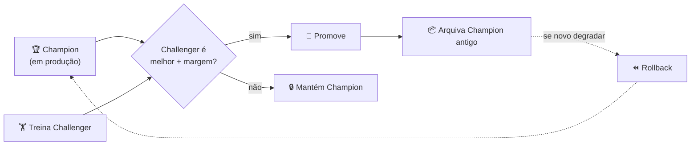
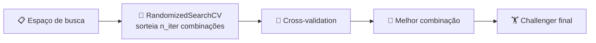
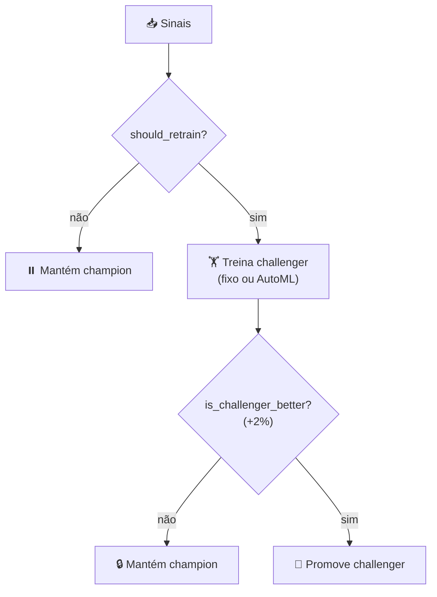

# 🎬 Vídeo 7.2 - Pipeline Automatizado + AutoML

**Aula**: 7 - Treinamento Automático e Re-Treino    
**Vídeo**: 7.2  
**Temas**: Champion/Challenger; AutoML; Comparação; Deploy; Rollback

---

## 🚀 Sobre Este Vídeo

> **"Treina, compara com o atual, promove se for melhor. Igual blue/green deploy."**

| Etapa | Descrição |
|-------|-----------|
| **Champion vs Challenger** | Modelo atual vs novo |
| **AutoML** | Busca automática de hiperparâmetros |
| **Comparar** | Métrica + margem de melhoria |
| **Deploy / Rollback** | Promover, ou reverter se piorar |

### Pré-requisitos

| Requisito | Como verificar |
|-----------|----------------|
| Vídeo 7.1 concluído | `policy.py` testado |
| scikit-learn | `python -c "import sklearn"` |

---

## 📚 Parte 1: Champion vs Challenger

| Termo | O que é |
|-------|---------|
| **Champion** | Modelo atual em produção |
| **Challenger** | Modelo novo, candidato |
| **Promoção** | Challenger vira Champion |
| **Rollback** | Voltar para o Champion anterior |


---

## 🛠️ Parte 2: Implementar o Pipeline

### Passo 2: Treino — fixo + AutoML (`training.py`)

São duas funções: `train_challenger` (hiperparâmetros fixos, baseline rápido) e `train_challenger_automl` (busca a melhor configuração).

**Criar `src/retrain/training.py`:**

```python
"""Treinamento de modelo (challenger).

    - train_challenger        → modelo fixo (baseline rápido).
    - train_challenger_automl → busca de hiperparâmetros (AutoML).
"""
import logging
from dataclasses import dataclass, field
from typing import Any, Optional

from sklearn.datasets import load_iris
from sklearn.ensemble import RandomForestClassifier
from sklearn.metrics import accuracy_score
from sklearn.model_selection import RandomizedSearchCV, train_test_split

logger = logging.getLogger(__name__)


@dataclass
class TrainedModel:
    """Resultado do treino."""

    model: Any
    accuracy: float
    version: str
    params: Optional[dict] = field(default=None)


def _load_split(random_state: int = 42):
    """Carrega o dataset e separa treino/teste de forma reprodutível."""
    X, y = load_iris(return_X_y=True)
    return train_test_split(
        X, y, test_size=0.2, random_state=random_state, stratify=y
    )


def train_challenger(version: str, n_estimators: int = 100) -> TrainedModel:
    """Treina um challenger com hiperparâmetros FIXOS."""
    logger.info(f"🏋️  Treinando challenger v{version} (fixo)...")
    X_tr, X_te, y_tr, y_te = _load_split()

    model = RandomForestClassifier(n_estimators=n_estimators, random_state=42)
    model.fit(X_tr, y_tr)

    accuracy = float(accuracy_score(y_te, model.predict(X_te)))
    logger.info(f"   Accuracy: {accuracy:.3f}")
    return TrainedModel(model=model, accuracy=accuracy, version=version)


def train_challenger_automl(
    version: str, n_iter: int = 10, cv: int = 5, random_state: int = 42
) -> TrainedModel:
    """Treina um challenger usando AutoML (busca de hiperparâmetros)."""
    logger.info(f"🤖 AutoML: buscando melhor challenger v{version} ({n_iter} combinações)...")
    X_tr, X_te, y_tr, y_te = _load_split(random_state=random_state)

    # Espaço de busca: o "cardápio" que o AutoML vai explorar.
    param_dist = {
        "n_estimators": [50, 100, 200, 300],
        "max_depth": [None, 3, 5, 10],
        "min_samples_split": [2, 5, 10],
        "max_features": ["sqrt", "log2", None],
    }

    search = RandomizedSearchCV(
        estimator=RandomForestClassifier(random_state=random_state),
        param_distributions=param_dist,
        n_iter=n_iter, cv=cv, scoring="accuracy",
        random_state=random_state, n_jobs=-1,
    )
    search.fit(X_tr, y_tr)

    best = search.best_estimator_
    accuracy = float(accuracy_score(y_te, best.predict(X_te)))
    logger.info(f"   🏅 Melhores params: {search.best_params_}")
    logger.info(f"   Test accuracy: {accuracy:.3f}")
    return TrainedModel(model=best, accuracy=accuracy, version=version,
                        params=search.best_params_)
```

**O que o AutoML faz:**



> 🗣️ **Como explicar (30s)**: "Em vez de chutar '100 árvores', dou um **cardápio** de opções pro AutoML. Ele sorteia algumas combinações, testa cada uma com validação cruzada e devolve a **campeã**. O botão que eu controlo é o `n_iter`: mais combinações = busca melhor, mais compute."

**Testar a busca** (`scripts/run_automl.py`):

```python
import logging
from retrain.training import train_challenger_automl

logging.basicConfig(level=logging.INFO, format="%(message)s")
result = train_challenger_automl("automl-1.0", n_iter=8, cv=5)
print(f"\naccuracy={result.accuracy:.3f} | params={result.params}")
```

```bash
PYTHONPATH=src python scripts/run_automl.py
# → 🏅 Melhores params: {...} | accuracy=0.967
```

> ⚠️ AutoML otimiza a métrica que você der (`scoring`). Só accuracy pode escolher um modelo lento ou enviesado — em produção, inclua latência/fairness.

---

### Passo 3: Comparar (`comparison.py`)

**Criar `src/retrain/comparison.py`:**

```python
"""Comparação entre champion e challenger."""
import logging

from retrain.training import TrainedModel

logger = logging.getLogger(__name__)


def is_challenger_better(
    champion: TrainedModel,
    challenger: TrainedModel,
    improvement_threshold: float = 0.02,
) -> bool:
    """True se o challenger é melhor que o champion + margem (default 2%)."""
    diff = challenger.accuracy - champion.accuracy
    logger.info(
        f"📊 Champion: {champion.accuracy:.3f} | "
        f"Challenger: {challenger.accuracy:.3f} | Diff: {diff:+.3f}"
    )
    if diff > improvement_threshold:
        logger.info(f"   ✅ Melhor (> {improvement_threshold})")
        return True
    logger.info(f"   ❌ Melhoria insuficiente (precisa > {improvement_threshold})")
    return False
```

> A margem evita "flip-flop": trocar o modelo por uma variação estatística de 0.1%.

---

### Passo 4: Deploy / Rollback (`deploy.py`)

**Criar `src/retrain/deploy.py`:**

```python
"""Deploy e rollback de modelos."""
import json
import logging
import shutil
from datetime import datetime
from pathlib import Path

import joblib

from retrain.training import TrainedModel

logger = logging.getLogger(__name__)

MODELS_DIR = Path("models")
PRODUCTION_PATH = MODELS_DIR / "production.pkl"
ARCHIVE_DIR = MODELS_DIR / "archive"
METADATA_PATH = MODELS_DIR / "production_meta.json"


def deploy(model: TrainedModel) -> None:
    """Promove challenger para produção (arquivando o anterior)."""
    MODELS_DIR.mkdir(exist_ok=True)
    ARCHIVE_DIR.mkdir(exist_ok=True)

    if PRODUCTION_PATH.exists():  # archive p/ rollback futuro
        ts = datetime.now().strftime("%Y%m%d_%H%M%S")
        archived = ARCHIVE_DIR / f"champion_{ts}.pkl"
        shutil.copy(PRODUCTION_PATH, archived)
        logger.info(f"📦 Champion arquivado em {archived}")

    joblib.dump(model.model, PRODUCTION_PATH)
    METADATA_PATH.write_text(json.dumps({
        "version": model.version,
        "accuracy": model.accuracy,
        "deployed_at": datetime.now().isoformat(),
    }, indent=2))
    logger.info(f"🚀 Modelo v{model.version} promovido para produção")


def rollback() -> None:
    """Restaura o champion arquivado mais recente."""
    archived = sorted(ARCHIVE_DIR.glob("champion_*.pkl"))
    if not archived:
        raise RuntimeError("Sem modelos arquivados para rollback")
    shutil.copy(archived[-1], PRODUCTION_PATH)
    logger.warning(f"⏪ Rollback feito: restaurado {archived[-1].name}")


def load_production_model():
    """Carrega o modelo atual de produção."""
    return joblib.load(PRODUCTION_PATH) if PRODUCTION_PATH.exists() else None
```

---

### Passo 5: Pipeline orquestrador (`pipeline.py`)



> 🗣️ **Como explicar (30s)**: "Uma linha de montagem com **4 portões**: preciso retreinar? → treino → ganhou com margem? → promovo. Cada portão pode encerrar o fluxo — é o que evita trocar o modelo por capricho."

**Criar `src/retrain/pipeline.py`:**

```python
"""Pipeline orquestrador: should_retrain → train → compare → deploy."""
import logging
from dataclasses import dataclass

from retrain.comparison import is_challenger_better
from retrain.deploy import deploy
from retrain.policy import RetrainSignals, should_retrain
from retrain.training import (
    TrainedModel,
    train_challenger,
    train_challenger_automl,
)

logger = logging.getLogger(__name__)


@dataclass
class PipelineResult:
    triggered: bool
    deployed: bool
    challenger_accuracy: float = 0.0
    reason: str = ""


def run_retrain_pipeline(
    signals: RetrainSignals,
    champion: TrainedModel,
    new_version: str,
    use_automl: bool = False,
) -> PipelineResult:
    """should_retrain → train (fixo/AutoML) → compare → deploy."""
    logger.info(f"🔄 Pipeline de re-treino (v{new_version})")

    if not should_retrain(signals):
        return PipelineResult(triggered=False, deployed=False, reason="sem sinal")

    if use_automl:
        challenger = train_challenger_automl(version=new_version)
    else:
        challenger = train_challenger(version=new_version)

    if not is_challenger_better(champion, challenger):
        return PipelineResult(
            triggered=True, deployed=False,
            challenger_accuracy=challenger.accuracy,
            reason="challenger não é significativamente melhor",
        )

    deploy(challenger)
    return PipelineResult(
        triggered=True, deployed=True,
        challenger_accuracy=challenger.accuracy, reason="promovido",
    )
```

---

## ▶️ Parte 3: Executar e Testar

### Passo 6: Rodar o pipeline

**Criar `scripts/run_pipeline.py`:**

```python
import logging
from retrain.pipeline import run_retrain_pipeline
from retrain.policy import RetrainSignals
from retrain.training import TrainedModel
from sklearn.ensemble import RandomForestClassifier

logging.basicConfig(level=logging.INFO, format="%(message)s")

champion = TrainedModel(  # champion "fraco"
    model=RandomForestClassifier(n_estimators=5).fit([[0, 0, 0, 0]], [0]),
    accuracy=0.85, version="1.0",
)
signals = RetrainSignals(5, 0.85, drift_detected=True, new_samples=100)

print(run_retrain_pipeline(signals, champion, new_version="2.0"))
```

```bash
PYTHONPATH=src python scripts/run_pipeline.py
```

**Resultado (resumido):**
```
➡️  DECISÃO FINAL: RE-TREINAR
📊 Champion: 0.850 | Challenger: 0.967 | Diff: +0.117  → ✅ promove
PipelineResult(triggered=True, deployed=True, ..., reason='promovido')
```

> 💡 Troque o champion para `accuracy=0.99` (forte): o challenger **não** será promovido (`deployed=False`).

### Passo 7: Demonstrar rollback

**Criar `scripts/demo_rollback.py`:**

```python
import logging
from retrain.deploy import deploy, load_production_model, rollback
from retrain.training import train_challenger

logging.basicConfig(level=logging.INFO, format="%(message)s")

deploy(train_challenger("1.0", n_estimators=100))  # v1.0
deploy(train_challenger("2.0", n_estimators=10))    # v2.0 (ruim)
rollback()                                          # volta p/ v1.0

print(f"Árvores após rollback: {load_production_model().n_estimators} (v1.0 = 100)")
```

```bash
PYTHONPATH=src python scripts/demo_rollback.py
# → ⏪ Rollback feito | Árvores após rollback: 100
```

### Passo 8: Testes

**Criar `tests/test_pipeline.py`:**

```python
"""Testes do pipeline de re-treino."""
from sklearn.ensemble import RandomForestClassifier

from retrain.pipeline import run_retrain_pipeline
from retrain.policy import RetrainSignals
from retrain.training import TrainedModel


def _champion(accuracy=0.85):
    return TrainedModel(
        model=RandomForestClassifier(n_estimators=5).fit([[0, 0, 0, 0]], [0]),
        accuracy=accuracy, version="1.0",
    )


def test_nao_treina_se_sem_sinal():
    result = run_retrain_pipeline(RetrainSignals(5, 0.95, False, 100), _champion(), "2.0")
    assert result.triggered is False


def test_promove_challenger_melhor(tmp_path, monkeypatch):
    monkeypatch.chdir(tmp_path)
    result = run_retrain_pipeline(RetrainSignals(5, 0.95, True, 100), _champion(0.50), "2.0")
    assert result.deployed is True


def test_nao_promove_challenger_pior(tmp_path, monkeypatch):
    monkeypatch.chdir(tmp_path)
    result = run_retrain_pipeline(RetrainSignals(5, 0.95, True, 100), _champion(0.99), "2.0")
    assert result.triggered is True and result.deployed is False
```

**Criar `tests/test_training_automl.py`:**

```python
"""Testes do AutoML."""
from retrain.training import train_challenger_automl


def test_automl_retorna_modelo_e_params():
    result = train_challenger_automl("2.0", n_iter=4, cv=3)
    assert 0.0 <= result.accuracy <= 1.0
    assert "n_estimators" in result.params
```

```bash
pytest -v
```

> 💡 Nos testes use `n_iter`/`cv` pequenos — o objetivo é validar o contrato, não fazer a melhor busca.

---

## 🔧 Troubleshooting

| Erro | Causa | Solução |
|------|-------|---------|
| Challenger sempre promovido | `threshold=0` | Usar `improvement_threshold=0.02` |
| Rollback falha | Sem arquivos em `archive/` | Rodar um `deploy` antes |
| `FileNotFoundError: production.pkl` | Primeiro deploy | OK: cria do zero |
| AutoML muito lento | `n_iter`/`cv` altos | Reduzir `n_iter` |

---

**FIM DO VÍDEO 7.2** ✅
