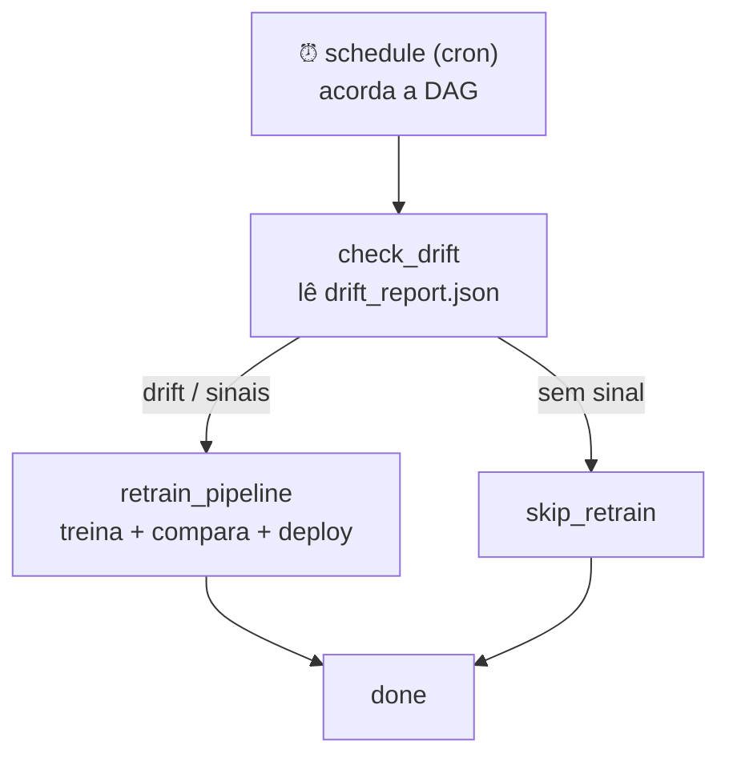

# 🎬 Vídeo 7.3 - Gatilhos de Re-Treino com Airflow

**Aula**: 7 - Treinamento Automático e Re-Treino    
**Vídeo**: 7.3  
**Temas**: Gatilho por drift; Lógica condicional (branch); Monitoramento

---

## 🚀 Sobre Este Vídeo

> **"O re-treino não roda no relógio. Roda quando o DRIFT manda."**

| Etapa | Descrição |
|-------|-----------|
| **Drift Gate** | Ler o drift da Aula 06 e decidir |
| **DAG condicional** | `BranchPythonOperator`: retreina ou pula |
| **Monitoramento** | Histórico em JSONL |

### Pré-requisitos

| Requisito | Como verificar |
|-----------|----------------|
| Vídeos 7.1 e 7.2 | `pipeline.py` funcionando |
| Docker + Docker Compose | `docker --version` |

> Já tem o Airflow da Aula 05 rodando? Pule para a Parte 1 (só confira os ajustes do Passo 0.2).

---

## 🐳 Parte 0: Subir o Airflow

### Passo 0.1: Baixar o compose oficial

```bash
curl -LfO 'https://airflow.apache.org/docs/apache-airflow/2.9.3/docker-compose.yaml'
mkdir -p dags logs plugins config data
echo "AIRFLOW_UID=$(id -u)" > .env
```

### Passo 0.2: Dois ajustes no `docker-compose.yaml`

No bloco `x-airflow-common`, adicione as libs de ML e o volume `data`:

```yaml
x-airflow-common:
  environment:
    # ... (mantenha o que já existe)
    _PIP_ADDITIONAL_REQUIREMENTS: scikit-learn==1.3.0 joblib==1.3.2
  volumes:
    # ... (mantenha o que já existe)
    - ${AIRFLOW_PROJ_DIR:-.}/data:/opt/airflow/data
```

> 🔍 **Nos bastidores**: a imagem oficial **não traz** scikit-learn/joblib. `_PIP_ADDITIONAL_REQUIREMENTS` instala no boot (ok pra didática; em produção, imagem custom). O volume `data` é onde o relatório de drift da Aula 06 fica acessível ao container (`/opt/airflow/data`).

### Passo 0.3: Inicializar e subir

```bash
docker compose up airflow-init    # cria o banco + usuário admin
docker compose up -d
```

UI em http://localhost:8080 (login `airflow` / `airflow`).

> ⚠️ Com `_PIP_ADDITIONAL_REQUIREMENTS`, o primeiro boot demora (instala as libs).

---

## 📚 Parte 1: Ponte Drift → Decisão

A Aula 06 grava um relatório de drift (KS test sobre os inputs). Aqui lemos esse relatório e o transformamos em sinais de re-treino.

### Passo 1: `drift_gate.py`

**Criar `src/retrain/drift_gate.py`:**

```python
"""Ponte entre a detecção de drift (Aula 06) e a decisão de re-treino."""
import json
import logging
import os
from pathlib import Path

from retrain.policy import RetrainSignals, should_retrain

logger = logging.getLogger(__name__)

DRIFT_REPORT_PATH = Path(
    os.getenv("DRIFT_REPORT_PATH", "/opt/airflow/data/drift_report.json")
)


def read_drift_report(path: Path = DRIFT_REPORT_PATH) -> dict:
    """Lê o relatório de drift. Se não existir, assume 'sem drift'."""
    if not path.exists():
        logger.warning(f"⚠️  Relatório não encontrado em {path} → sem drift")
        return {"drift_detected": False, "days_since_last_train": 0,
                "current_accuracy": 1.0, "new_samples": 0}
    report = json.loads(path.read_text())
    logger.info(f"📥 Drift report: {report}")
    return report


def build_signals(report: dict) -> RetrainSignals:
    """Converte o relatório de drift em sinais de re-treino."""
    return RetrainSignals(
        days_since_last_train=int(report.get("days_since_last_train", 0)),
        current_accuracy=float(report.get("current_accuracy", 1.0)),
        drift_detected=bool(report.get("drift_detected", False)),
        new_samples=int(report.get("new_samples", 0)),
    )


def decide_branch(
    retrain_task_id: str = "retrain_pipeline",
    skip_task_id: str = "skip_retrain",
    **context,
) -> str:
    """Branch da DAG: decide se segue para re-treino ou pula."""
    signals = build_signals(read_drift_report())
    return retrain_task_id if should_retrain(signals) else skip_task_id
```

> 🔍 **Nos bastidores**: `decide_branch` não treina nada — só lê o drift e devolve o `task_id` do próximo passo. Estar fora da DAG é o que permite testá-lo com `pytest` sem subir o Airflow.

**Exemplo de `drift_report.json`** (na demo, criamos à mão; em produção, vem da Aula 06):

```json
{ "drift_detected": true, "drift_score": 0.27,
  "days_since_last_train": 12, "current_accuracy": 0.88, "new_samples": 1200 }
```

---

## ⚙️ Parte 2: A DAG com Gatilho por Drift

### Passo 2: O job que a task executa (`job.py`)

**Criar `src/retrain/job.py`:**

```python
"""Job de re-treino executado pela task do Airflow."""
import logging

from retrain.drift_gate import build_signals, read_drift_report
from retrain.monitoring import log_retrain_event
from retrain.pipeline import run_retrain_pipeline
from retrain.training import train_challenger

logger = logging.getLogger(__name__)


def retrain_job():
    """Lê o drift, roda o pipeline e registra o resultado."""
    signals = build_signals(read_drift_report())
    champion = train_challenger("1.0")

    result = run_retrain_pipeline(signals, champion, new_version="2.0")
    logger.info(f"✅ Job concluído: {result}")

    log_retrain_event(
        triggered=result.triggered,
        deployed=result.deployed,
        accuracy=result.challenger_accuracy,
        reason=result.reason,
    )
    return result
```

> Sem lock manual: o `max_active_runs=1` da DAG já garante que só 1 execução roda por vez.

### Passo 3: A DAG condicional (`BranchPythonOperator`)

**Criar `dags/retrain_dag.py`:**

```python
"""DAG Airflow para re-treino DISPARADO POR DRIFT."""
from datetime import datetime, timedelta

from airflow import DAG
from airflow.operators.empty import EmptyOperator
from airflow.operators.python import BranchPythonOperator, PythonOperator

RETRAIN_PKG_PATH = "/opt/airflow/dags/retrain"


def _check_drift_branch(**context) -> str:
    import sys
    sys.path.insert(0, RETRAIN_PKG_PATH)
    from retrain.drift_gate import decide_branch
    return decide_branch("retrain_pipeline", "skip_retrain", **context)


def _retrain(**context):
    import sys
    sys.path.insert(0, RETRAIN_PKG_PATH)
    from retrain.job import retrain_job
    retrain_job()


def alert_failure(context):
    ti = context["task_instance"]
    print(f"🚨 ALERTA: {ti.task_id} falhou em {ti.dag_id}")


default_args = {
    "owner": "fiap",
    "retries": 2,
    "retry_delay": timedelta(minutes=5),
    "on_failure_callback": alert_failure,
}

with DAG(
    dag_id="retrain_automatic",
    description="Re-treino disparado por detecção de drift",
    default_args=default_args,
    start_date=datetime(2026, 1, 1),
    schedule="0 2 * * *",       # checa diariamente às 2h UTC
    catchup=False,
    max_active_runs=1,
    tags=["fiap", "ml", "retrain", "drift"],
) as dag:

    check_drift = BranchPythonOperator(
        task_id="check_drift", python_callable=_check_drift_branch
    )
    retrain = PythonOperator(
        task_id="retrain_pipeline", python_callable=_retrain
    )
    skip = EmptyOperator(task_id="skip_retrain")
    done = EmptyOperator(
        task_id="done", trigger_rule="none_failed_min_one_success"
    )

    check_drift >> [retrain, skip] >> done
```

**Fluxo da DAG:**



> 🗣️ **Como explicar (30s)**: "A DAG acorda no horário do cron, mas **não treina direto**. O `check_drift` lê o relatório de drift e escolhe o caminho: tem drift → `retrain_pipeline`; não tem → `skip_retrain`. Os dois se encontram no `done`. O agendamento virou só o **despertador** — quem decide treinar é o drift."

> 🔍 **Nos bastidores**: o ramo não escolhido fica `skipped`. Por isso o `done` usa `trigger_rule="none_failed_min_one_success"` — senão a regra padrão (`all_success`) marcaria o `done` como skipped também.

### Passo 4: Cron do Airflow

| Schedule | Significado |
|----------|-------------|
| `"@daily"` | Todo dia à meia-noite UTC |
| `"0 2 * * *"` | Diário 2h UTC |
| `"0 */6 * * *"` | A cada 6 horas |

> ⚠️ `catchup=False` evita rodar todo o histórico desde o `start_date`.

---

## ▶️ Parte 3: Rodar no Airflow

### Passo 5: Subir e disparar

```bash
# 1. Disponibilizar o pacote para a DAG
cp -r src/retrain dags/retrain
cp data/drift_report.example.json data/drift_report.json   # simula drift

# 2. Na UI do Airflow: ativar a DAG `retrain_automatic` e Trigger DAG
```

Na UI (Graph view), observe o branch: com drift, o caminho acende em `retrain_pipeline → done`; sem drift, em `skip_retrain → done`.

> 💡 **Smoke local** (sem Airflow), para validar o job rápido:
> ```bash
> PYTHONPATH=src DRIFT_REPORT_PATH=data/drift_report.example.json \
>   python scripts/run_job.py
> ```

---

## 📊 Parte 4: Monitoramento

### Passo 6: Logger Estruturado (`monitoring.py`)

**Criar `src/retrain/monitoring.py`:**

```python
"""Logger estruturado para monitoramento de re-treino (JSONL)."""
import json
from datetime import datetime
from pathlib import Path

LOG_FILE = Path("logs/retrain_history.jsonl")


def log_retrain_event(triggered, deployed, accuracy, reason) -> None:
    """Adiciona uma linha JSON ao histórico."""
    LOG_FILE.parent.mkdir(exist_ok=True)
    event = {
        "timestamp": datetime.now().isoformat(),
        "triggered": triggered, "deployed": deployed,
        "accuracy": accuracy, "reason": reason,
    }
    with LOG_FILE.open("a") as f:
        f.write(json.dumps(event) + "\n")


def summary():
    """Resumo simples do histórico."""
    if not LOG_FILE.exists():
        print("Sem histórico ainda.")
        return
    events = [json.loads(l) for l in LOG_FILE.read_text().splitlines()]
    deployed = sum(1 for e in events if e["deployed"])
    print(f"Total: {len(events)} | Deploys: {deployed}")
    print(f"Última: {events[-1]['timestamp']} → {events[-1]['reason']}")
```

> 💡 **JSONL** = uma linha por evento. Fácil de processar (jq, pandas) e exportar pra Datadog/CloudWatch.

### Passo 7: Testar o branch de drift

**Criar `tests/test_drift_gate.py`:**

```python
"""Testes do gate de drift."""
from retrain.drift_gate import decide_branch, read_drift_report


def test_report_inexistente_assume_sem_drift(tmp_path):
    assert read_drift_report(tmp_path / "x.json")["drift_detected"] is False


def test_branch_retreina_com_drift(monkeypatch):
    monkeypatch.setattr("retrain.drift_gate.read_drift_report",
                        lambda *a, **k: {"drift_detected": True, "current_accuracy": 0.9})
    assert decide_branch() == "retrain_pipeline"


def test_branch_pula_sem_sinal(monkeypatch):
    monkeypatch.setattr("retrain.drift_gate.read_drift_report",
                        lambda *a, **k: {"drift_detected": False, "days_since_last_train": 1,
                                         "current_accuracy": 0.99, "new_samples": 10})
    assert decide_branch() == "skip_retrain"
```

```bash
pytest tests/test_drift_gate.py -v
```

> 🔍 **Nos bastidores**: `monkeypatch` troca `read_drift_report` por um fake — testamos a decisão sem arquivo de drift nem Airflow.

---

## 🔧 Troubleshooting

| Erro | Causa | Solução |
|------|-------|---------|
| Airflow não detecta DAG | Path errado | Verificar `/opt/airflow/dags/` |
| `done` fica `skipped` | `trigger_rule` padrão | Usar `none_failed_min_one_success` |
| Branch nunca retreina | `drift_report.json` ausente | Conferir `DRIFT_REPORT_PATH` |
| `ModuleNotFoundError: retrain` | Pacote não montado | `cp -r src/retrain dags/retrain` |
| Timezone errado | Default UTC | `pendulum.timezone("America/Sao_Paulo")` |

---

**FIM DO VÍDEO 7.3** ✅

---

## 🏆 Recapitulação da Aula 07

| Vídeo | O que aprendeu |
|-------|---------------|
| **7.1** | Data vs concept drift, revalidação contínua + 4 estratégias |
| **7.2** | Pipeline automatizado, AutoML, champion/challenger, deploy, rollback |
| **7.3** | DAG Airflow disparada por drift (branch condicional) + monitoramento |

